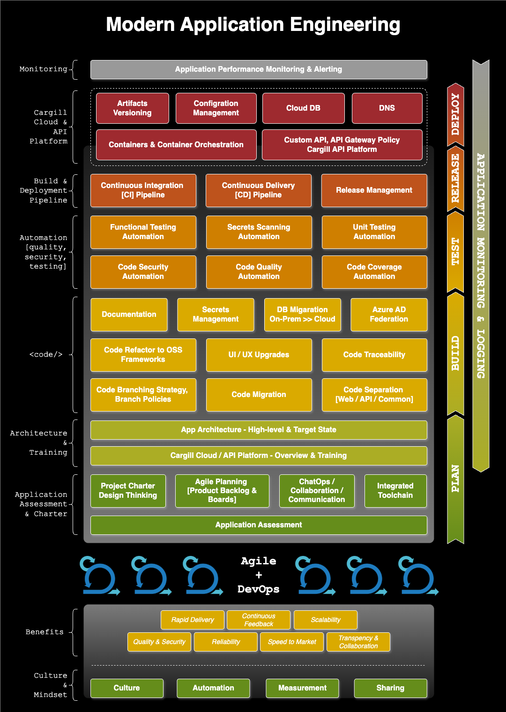

# Software Engineering Practices

## My Role

As part of my work to uplift engineering maturity across product teams, I created and rolled out a comprehensive set of **Modern Engineering Practices** — a blueprint for building scalable, secure, and high-quality digital products on the Cloud Platform.

These practices bring together cloud-native architecture, automation, Agile + DevOps culture, and a fully integrated toolchain. The goal was to provide teams — whether modernizing legacy applications or building greenfield solutions — with a clear, opinionated path to engineering excellence.

The following visual summarizes the key capabilities and practices, layered across planning, build, test, release, deploy, and monitor stages.

---

## Key Engineering Practice Areas

- **Agile + DevOps Culture**: A mindset that embraces iteration, rapid feedback, automation, and collaboration  
- **Cloud-Native Development**: Containerized apps, microservices, and scalable API-first architectures  
- **Integrated Engineering Toolchain**: From Jira to GitHub to CI/CD to monitoring, enabling end-to-end traceability  
- **Infrastructure as Code (IaC)**: Fully automated infrastructure provisioning using Terraform, and Cloud Platform  
- **Source Control & Branching Strategy**: GitHub Enterprise with GitFlow/GitHubFlow, tagging, and hotfix support  
- **Continuous Integration & Delivery**: Pipelines with built-in gates for quality, coverage, security, and observability  
- **Shift-Left Testing**: Early, automated testing — unit, functional, regression, and security — integrated into the CI/CD lifecycle  
- **Code Quality & Security Automation**: Static code analysis, vulnerability scanning, linting, and traceability  
- **Monitoring & Observability**: Datadog-based alerting and real-time feedback loops  
- **Communication & Collaboration**: Embedded ChatOps (MS Teams), integrated Jira conversations, and cross-functional planning  
- **Documentation & Traceability**: From user stories to code commits, PRs, test cases, and deployment artifacts  
- **Architecture & Reusability**: Modular design, common APIs, reusable components, and federated access control

---

## How It's Used

This blueprint now serves as the **engineering foundation for all new product teams** — whether they’re:
- Starting with greenfield development  
- Modernizing legacy workloads  
- Migrating applications to the cloud  

It gives them a clear path to build quality in from day one, standardize delivery, and operate with confidence.

---

## Impact to community

By operationalizing these practices across engineering pods, we’ve:
- Accelerated delivery speed and reduced defects  
- Increased test coverage and CI/CD adoption  
- Improved cross-team collaboration and reuse  
- Enabled traceability and compliance by design