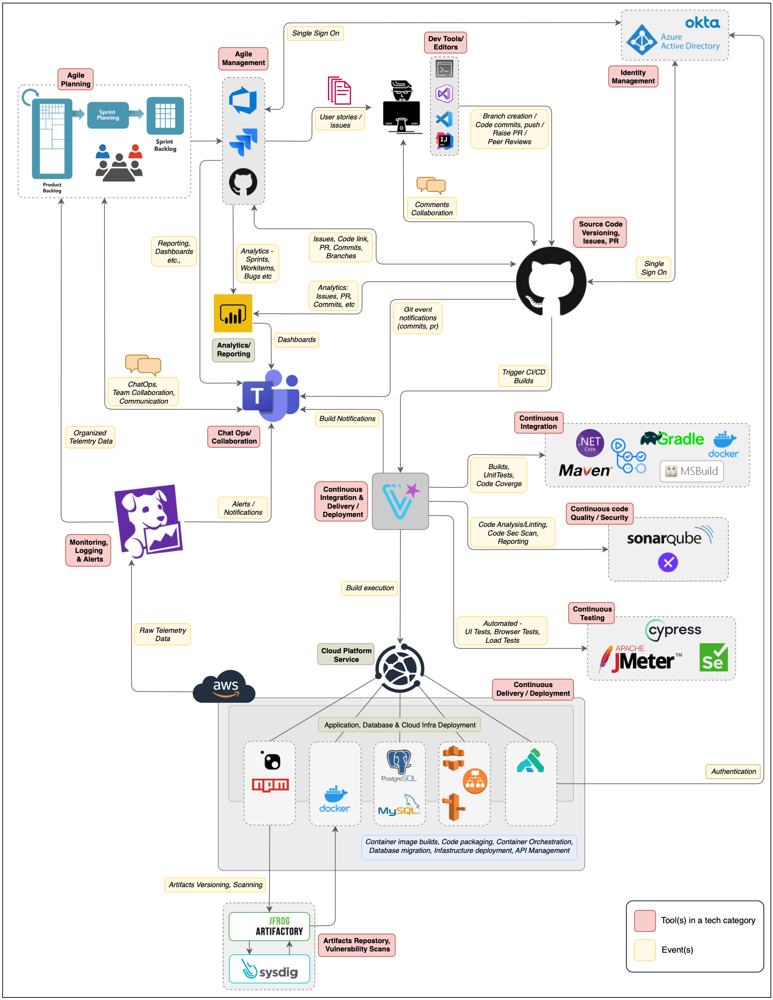

# Engineering Toolchain & CI/CD

## My Role

To enable modern software delivery at scale, I led the design and implementation of a **fully integrated engineering toolchain**. This toolchain connects planning, coding, building, testing, releasing, and monitoring into a seamless, secure workflow — allowing product teams to move faster, improve quality, and reduce operational risk.

This initiative was foundational in shifting the organization toward a **DevOps and platform engineering model**, where CI/CD and observability are first-class citizens across every product team.

### Philosophy

`The CI/CD toolchain is not just a way to ship code — it’s a strategic enabler of velocity, safety, and scale`

---

## Toolchain Visual

---

## Impact

By standardizing and scaling this CI/CD toolchain:

- We enabled teams to deliver with speed and confidence  
- Reduced manual effort, defects, and release risk  
- Gained complete traceability across the development lifecycle  
- Created a consistent and secure experience for every product team

